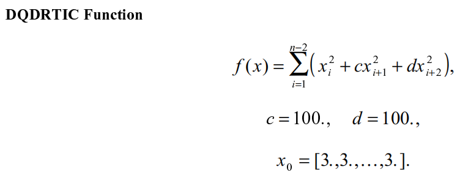
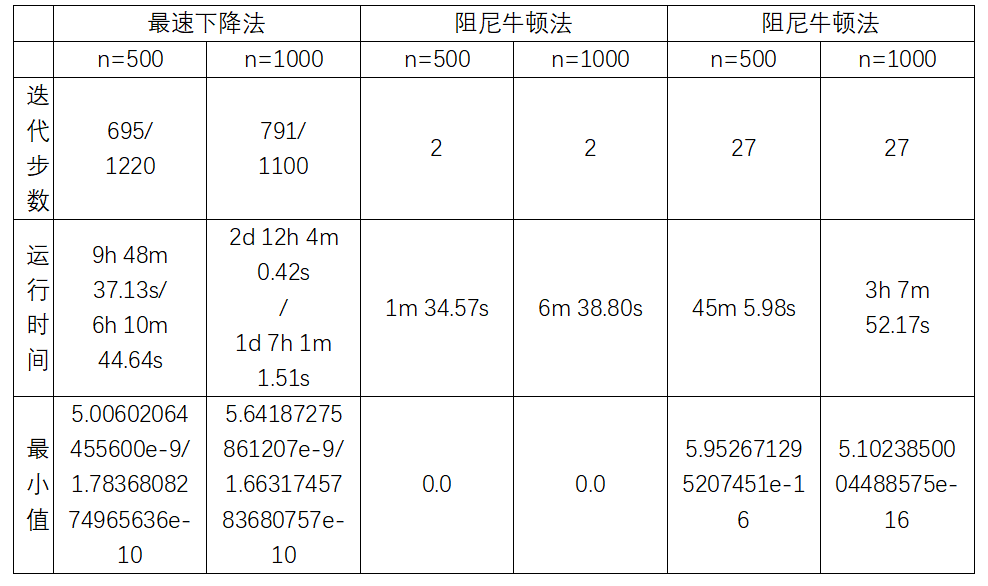

# 2021 SCUT秋季最优化计算课程无约束优化作业 

请针对上述DQDRTIC测试函数，取n=500，1000，用最速下降法、阻尼牛顿法、拟牛顿法分别运行给出实验结果，格式见下表。

表1 不同梯度类方法在DQDRTIC测试函数上的表现

①一开始写的程序是按照书上符号表示的思路，采用符号形式对表达式求导，再将数值带入，求得导数值，非常耗时。从解决问题的意义上来说，如果符号能求导，也不需要数值计算了，而且黑塞矩阵很大，符号求导也不现实，所以后边的程序都改为数值求导。

②求解最佳步长的步骤，上次已经实现过一维搜索，这次就采用符号求导，再带入数值的方法，因为这里只有一个变量。

③阻尼牛顿法只需要两次迭代就求得精确值，与理论相符。

④实验采用Python语言编程，使用了计算机代数（符号计算）库SymPy进行符号求导。采用深度学习中成熟的Pytorch框架进行自动数值求导。Pytorch直接定义基础函数的导函数，通过链式法则进行梯度的反向传播。运行时间是在Intel Core i7-7700上测得的。